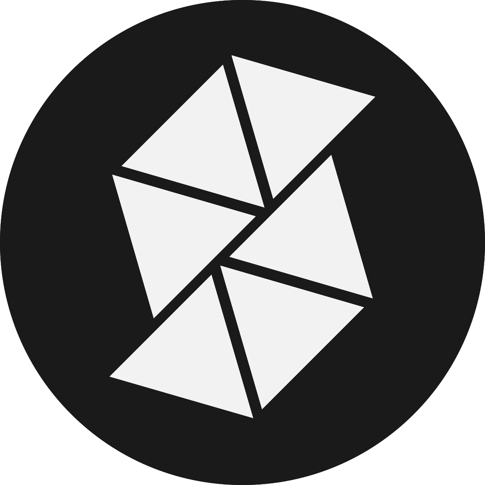
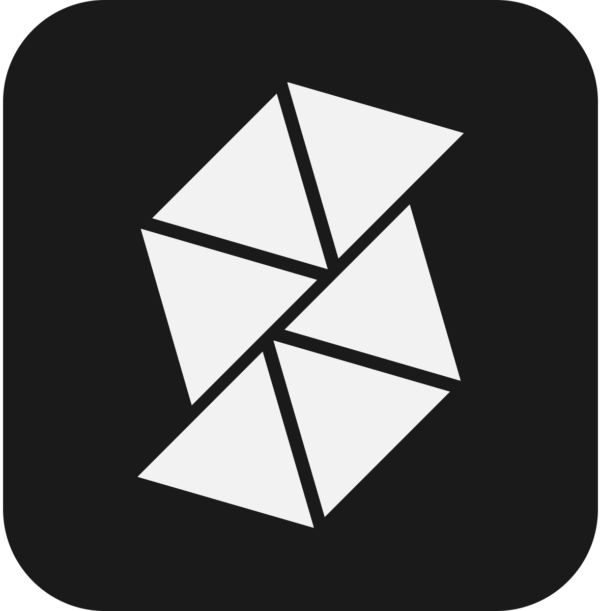
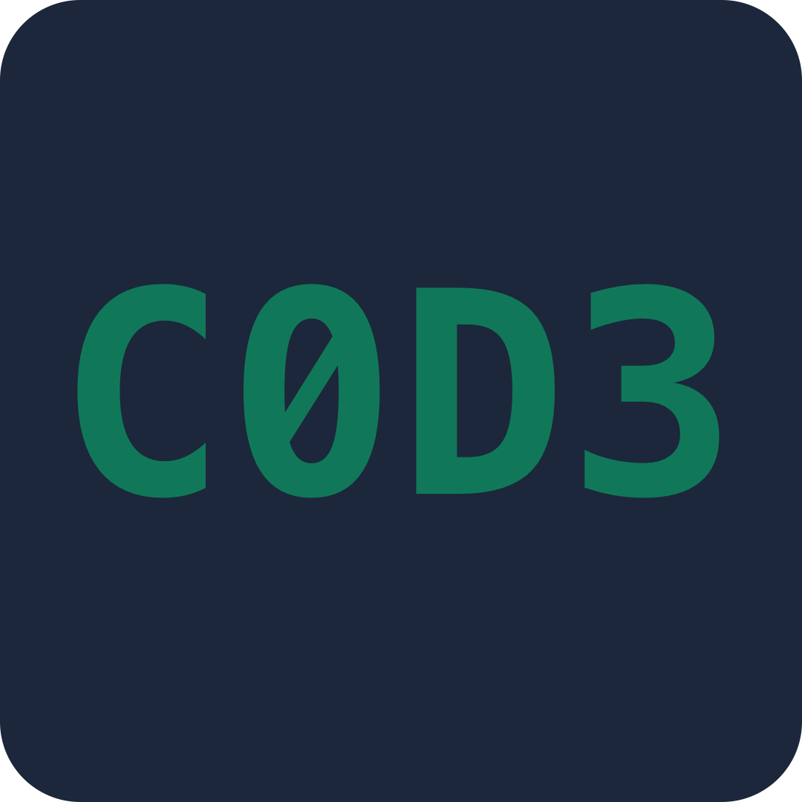
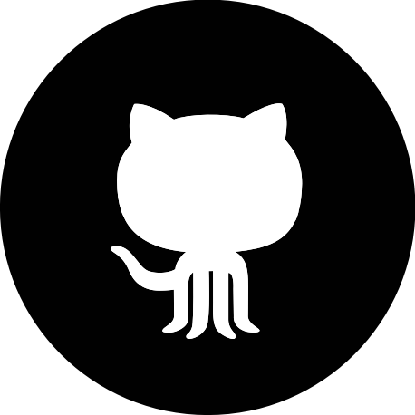
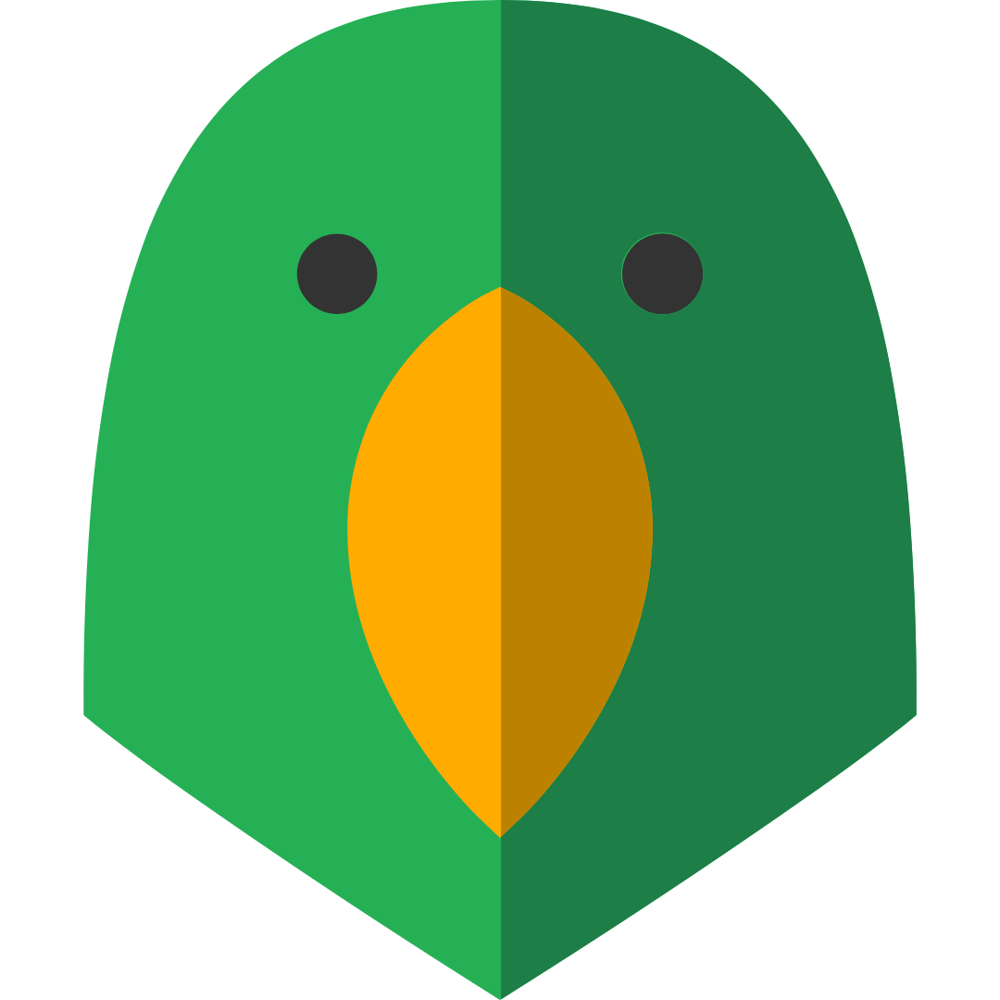

---
title: Projects
layout: default
filename: projects.md
--- 

# Projects

## Multility

 

Multiple utilities in one. A summer project with friends for an intro to mobile development and the Android ecosystem. Micro-apps include a tip calculator, a stopwatch, a notepad, a password generator, a fact generator, and a trending news page, to meet one's everyday utility-based needs (still preparing the repository for public view).

## Multility-iOS

Multility's port to iOS. This is a work-in-progress with the end goals being to gain new customers from this second popular platform, as well as learn the iOS ecosystem for Apple development (still preparing the repository for public view).

## CaesarBreaker

 

A caesar cipher encryption/decryption tool with a sleek, blue "hacker-like" design. This was made as the final project for the course ICS2O1/3U1 using only modules from the Python standard library as per the requirements (tkinter, ttk).

## ConureLang

 

A small, dynamically-typed, object-oriented scripting language made in C that takes inspiration from Python, JS, and Ruby. This is a work-in-progress hobby project for me to learn programming language design, as well as parsing and interpreting chunks of data for processing. 
