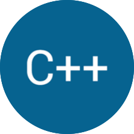

---
title: Technologies
layout: default
filename: tech.md
--- 

<!-- TODO: Add dynamic centering for it to look the same on mobile -->

# Technologies
 

I've been exposed to multiple programming languages, and various frameworks and tools, either in school, by taking Udemy courses, or just by digging around for resources from the internet. I have a basic to moderate understanding of most of the below enumerated languages/frameworks/tools and I've used them to accomplish school as well as personal projects.
  

  
  

    <strong>Python</strong> - As a general-purpose programming language, I use it for basically everything. Automation, ethical hacking, DS/ML, desktop development, even recently started learning a tiny bit of Django for web (intermediate level).
  

 

  
  

    <strong>Java</strong> - My first compiled language. I mainly use it for Android development, desktop development, as well as some game development with LibGDX and modding in Minecraft (basic to intermediate level).
  

 

  
  

    <strong>JavaScript</strong> - No software developer can live without JS, and that's also true for me. I had mainly been using it for small, simple web projects and only recently hopped on to try serverless and hybrid frameworks like Node, Deno, and React / React Native (basic level).
  

 

  
  

    <strong>C/C++</strong> - I wanted to get some low-level programming experience and there is no better way than C/C++. I started both together and mainly use them for desktop development, language development, and some game development with Cocos2d-x (basic).
  

 

  
  

    <strong>JetBrains IDEs</strong> - I had been using a text editor for basically everything until last year where I upgraded to full IDEs for each platform. They have incredible features and I use them almost everyday. IntelliJ, PyCharm, RubyMine, you name it (intermediate level). 
  

 

  
  

    <strong>Git</strong> - VCS is a must for any updatable project and I hopped on the Git train. Only really started being active this past summer with Multility and all these other recent tiny projects of mine, but I don't think I could ever go back to working without it (intermediate level).
  

 

  
  

    <strong>Android</strong> - One of the two dominating mobile platforms. Android development is very fun and there's a lot of freedom from Google's policies and guidelines. Only worked on Multility so far, but I bet I will make more apps in the future (basic to intermediate level).
  

 

  
  

    <strong>iOS</strong> - The other dominating platform on mobile. Apple's platform has always been interesting to me with the very sophisticated aesthetic and streamlined process, but I'm on board with it for porting Multility to iOS and making other apps as well (basic level).
  

